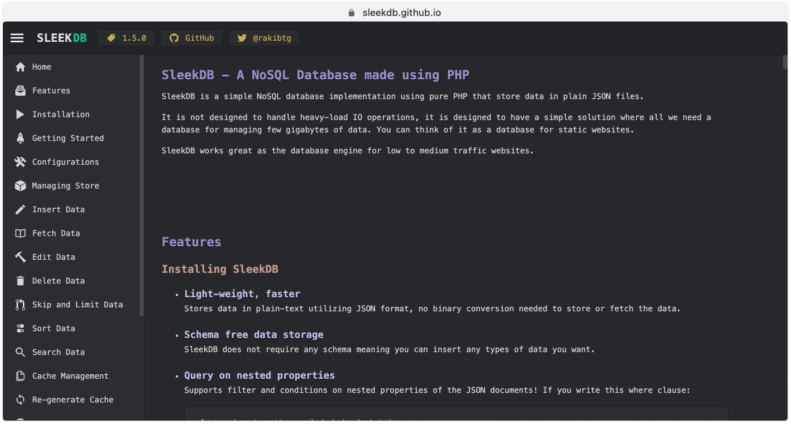

# SleekDB Website

The official website of SleekDB [sleekdb.github.io](https://sleekdb.github.io) is hosted on Github Sites.


The purpose of this website is to serve the documentation of SleekDB.

## Add or Update Docs

- Go to the [docs](https://github.com/SleekDB/docs) repository and clone it.
- You will find some directories which are named according to their version and they contains some markdown(.md) files. If you are not familiar with markdown text format theres an easy [markdown cheet sheet](https://github.com/adam-p/markdown-here/wiki/Markdown-Cheatsheet) for you.
- If you want to update documentation of an existing page then find the markdown file, update the content and then create a pull request.
- If you want to create a new documentation page then

  - Register the file name in the `lists.json` file; Example: [lists.json file of version 1.5](https://github.com/SleekDB/docs/blob/master/1.5.0/lists.json)
  - If you want to add it to the sidebar menu then add this HTML comment at the top of the markdown file:

    ```html
    <!--METADATA
    {
        "title": "Insert Data",
        "url": "insert-data",
        "icon": "create"
    }
    !METADATA-->
    ```

    You can find available icons from [ionicons](https://ionicons.com/v4/).

  - Please try to keep the file name and `url` same!

- Once you are happy with the changes then create a Pull Request!
- Also, join our [Telegram channel](https://t.me/joinchat/HWnK7UL429QGXfs7) for community discussion.
